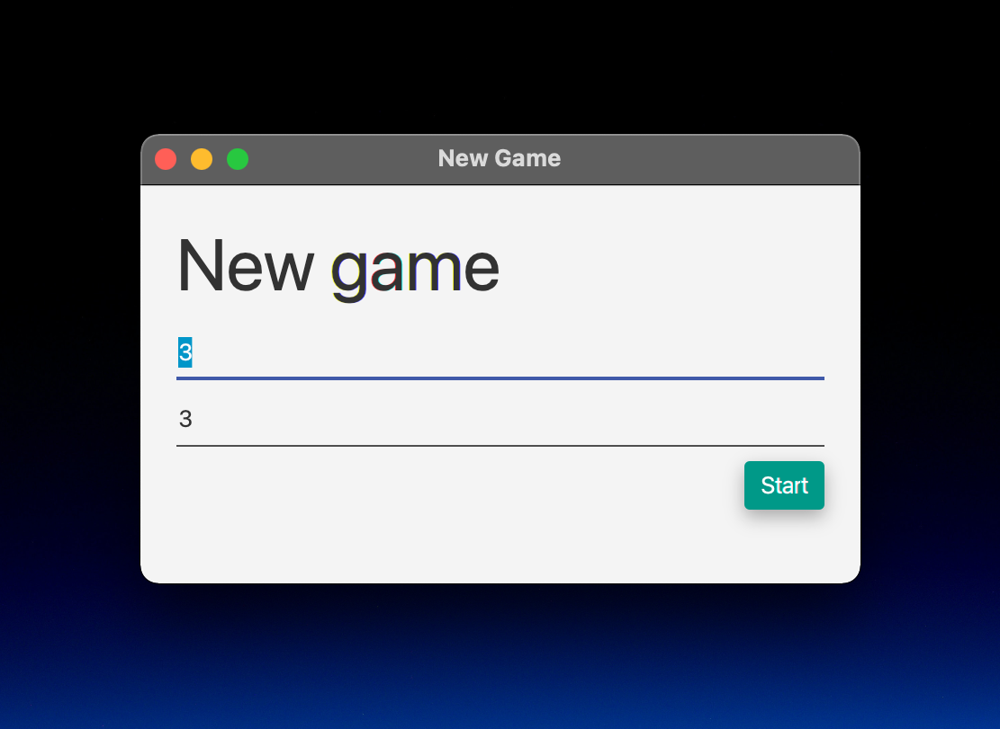
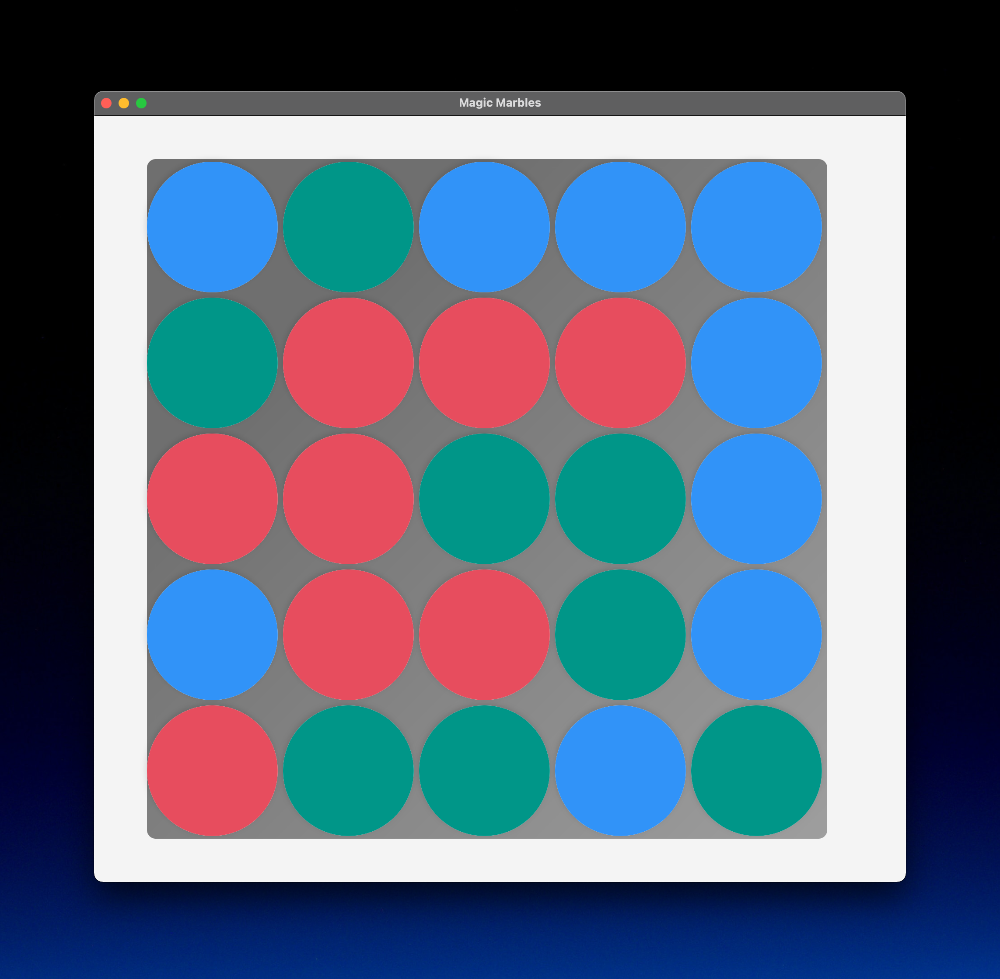
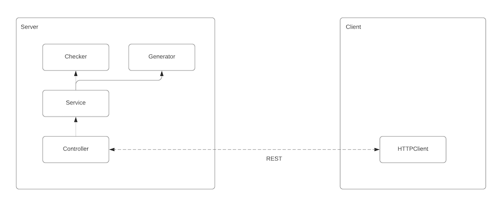
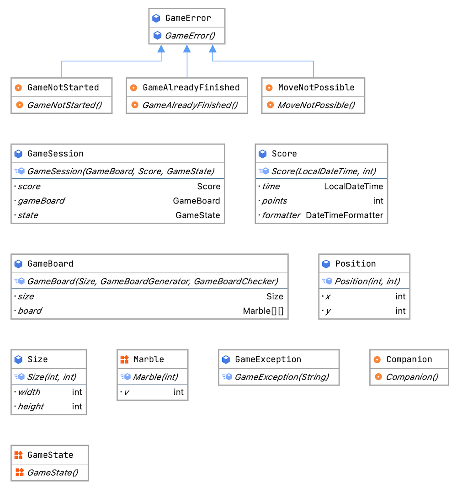
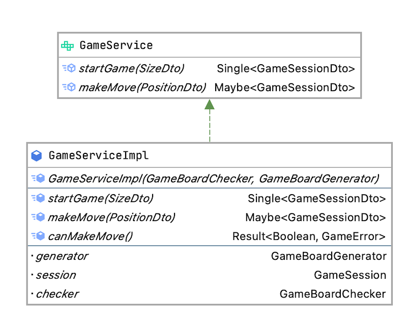
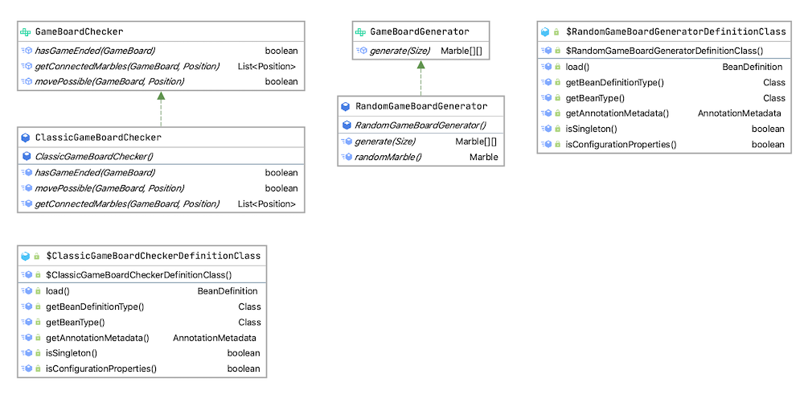

# Magic Marbles

## 💻 Used technologies
* Server: Micronaut, Kotlin
* Client: JavaFX, Afterburner.fx, Java

## 🚀 Get Started
**Run server JVM**
```bash
cd server
./gradlew run
```

**Run server native image**
>Requires GraalVM with native-image tool
```bash
cd server
./gradlew nativeImage
./build/native-image/magic-marbles
```

**Run client**
```bash
cd client
./gradlew openApiGenerate # server must be built
./gradlew run
```

## 🚧 Limitations

* Due to a bug the event click handler in JavaFX does not work and I did not have enough time left to further investigate the problem.

## ✨ Features




## 🏗 Architecture



**Client**: The program consists of controller and the corresponding view. Theses views are realised in FXML which describe the layout. Additionally, each view has a CSS file for more granular styling. To reduce redundancy in code an abstract class _BaseController_ helps to open new windows. With the help of the [Afterburner framework](http://afterburner.adam-bien.com) it is also possible to inject services into views for better decoupling which can be seen in the following example:

```java
public class BoardPresenter extends BasePresenter implements Initializable {
  ...
  @Inject
  public GameService gameService;
  ...
}
```

**Server**: When most developers think of IoC in the Java world the Spring Framework comes to mind. Unlike Spring which relies exclusively on runtime reflection and proxies, Micronaut, on the other hand, uses compile time data to implement dependency injection. This feature is extensively used in the whole program for better testability and looser coupling which can be seen in the following examples.

```kotlin
@Controller("/api/game")
@Validated
class GameSessionController @Inject constructor(private val gameService: GameService) {
	...
}
```

```kotlin
@Singleton
class GameServiceImpl(var checker: GameBoardChecker, var generator: GameBoardGenerator): GameService {
	// even though the dependencies are not marked with @Inject both parameters are injected
	...	
}
```

### Entities


### Service layer


### Logic

